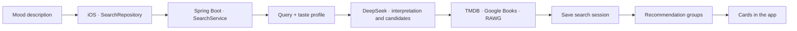
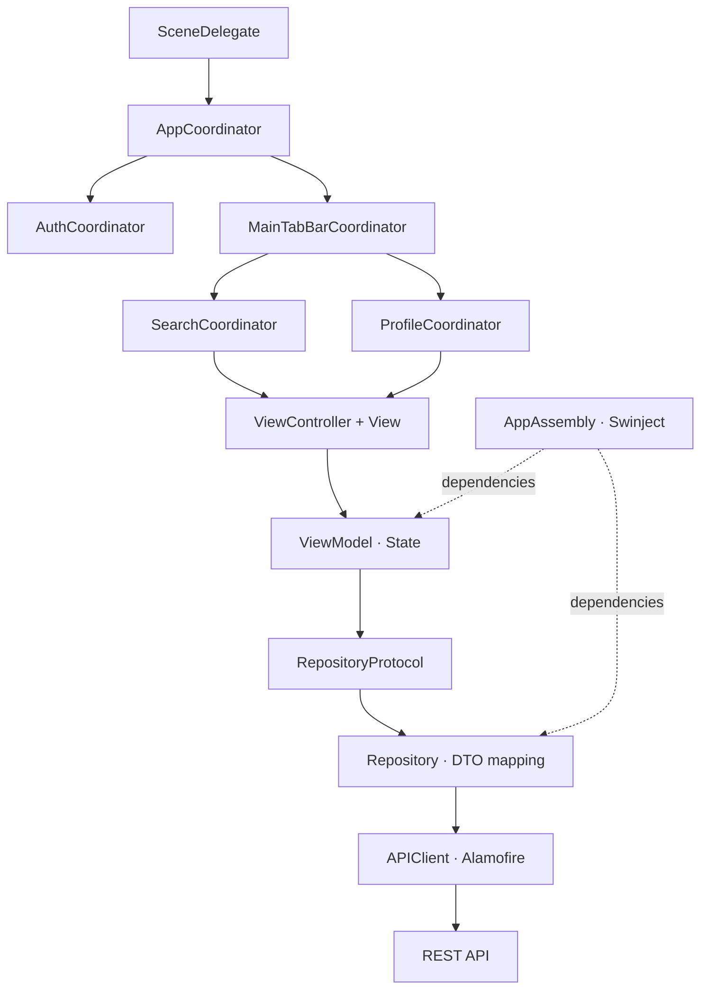

<h1 align="center">VibeFinder</h1>
<p align="center"><em>Find your next story, follow your mood.</em></p>

<p align="center">
  <strong>Movies · Series · Books · Games</strong><br />
  Personal recommendations that start with your mood.
</p>

<p align="center">
  
  
  
  
</p>

<p align="center">
  <a href="#-the-idea">The idea</a> ·
  <a href="#-demos">Demos</a> ·
  <a href="#-features">Features</a> ·
  <a href="#-architecture">Architecture</a> ·
  <a href="#-getting-started">Getting started</a> ·
  <a href="#-testing">Testing</a>
</p>

---

## ✨ The idea

Sometimes you start with a **feeling**: a cozy evening, a mysterious story, beautiful science fiction, or a weekend adventure.

**VibeFinder** is an iOS app for discovering movies, series, books, and games through natural language. Describe your mood, reference something you love, suggest a pace, or mention elements you would like to avoid. The backend interprets your request with DeepSeek, considers your taste profile, and enriches recommendations with media catalog data.

> “Something like Interstellar: space, strong emotions, and beautiful visuals.”
>
> “A cozy game for the evening, with simple controls and no stressful combat.”
>
> “A dark detective story, without horror.”

This repository contains the **mobile client**. The server is developed separately in [VibeFinder-backend](https://github.com/ArturBagautdinov/VibeFinder-backend).

## 🎬 Demos


### 01 · Onboarding


### 02 · Search by mood

Choose a suggested vibe or write your own description, submit the request, and explore the results.

### 03 · Recommendation results

Media cards, match percentages, recommendation groups, and a sticky summary while scrolling.

### 04 · Custom suggestions

Add a personal prompt, browse the full list, remove a suggestion, and restore the built-in options.


### 05 · Vibe history

Recent prompts, the complete search history, and reopening a saved recommendation session.


### 06 · Profile and avatar

Taste preferences, statistics, name editing, and avatar customization with a live preview.


## 💜 Features

### Search in your own words

- Natural language prompts: moods, favorite titles, atmosphere, genres, or story preferences.
- 24 built-in suggestions, from cozy evenings and beautiful sci-fi to cosmic horror and couch co-op games.
- The first five suggestions on the main screen, with the full list available in a bottom sheet.
- Custom suggestions that can be added, removed, and preserved between launches.
- Restore missing built-in suggestions while keeping your personal ones.
- Empty-query validation, loading states, and API error messages.

### Recommendations with a clear structure

Results are organized into groups that explain how each recommendation relates to your request:

| Group | Meaning |
| :--- | :--- |
| **Exact match** | The closest direct fit for your request |
| **Atmosphere match** | A similar mood and emotional feel |
| **Theme match** | Related themes or story elements |
| **Hidden gems** | Less obvious titles worth discovering |
| **Adjacent picks** | Nearby directions to explore next |

Cards show a cover, title, media type, year, first genre, and match percentage. The strongest matches receive a visual highlight. As you scroll, the query summary remains available in a compact sticky capsule. Empty groups are omitted, and missing images use a visual placeholder.

The match percentage is an estimate from the recommendation model. The backend also returns a media catalog rating, although the current client card does not display it.

### History you can revisit

- The three most recent searches on the main screen.
- Full history with recommendation counts and search dates.
- Reopen saved results by search session ID.
- Delete individual searches or clear the entire history.
- Immediate list updates on deletion, with rollback if the server returns an error.
- Successful searches appear in recent history immediately, even before the refreshed API history includes them.

### A profile with personality

The profile combines account details, email verification status, a taste summary, and preference tags: genres, themes, atmospheres, settings, and unwanted elements. It also displays backend counters for completed titles, titles in progress, and hidden recommendations.

The editor lets you change your first and last name, choose an SF Symbol avatar, use a colored avatar with initials, or remove the avatar styling. There are **32 symbols and 20 colors**, with an instant preview. Saving synchronizes the avatar with the search screen header.

### Authentication and interface

- Animated onboarding with floating prompt clouds and a moving brand title.
- Sign-in, registration, client-side form validation, and server messages.
- Access and refresh tokens stored in Keychain, with session restoration at launch.
- Sign-out with local token cleanup.
- English and Russian localization, with the request language passed through `Accept-Language`.
- A dark theme with violet and cyan accents, gradients, and animations.
- Programmatic UIKit views with Auto Layout; a storyboard is used for the launch screen.

## 🧠 How recommendations work



1. The client submits a description to `POST /api/search`.
2. The server adds taste profile context and asks DeepSeek for a structured interpretation and recommendation candidates.
3. TMDB enriches movies and series, Google Books enriches books, and RAWG enriches games with covers, descriptions, ratings, and other metadata.
4. The server saves the session and recommendations in PostgreSQL, updates the taste profile, and returns a `searchSessionId`.
5. The client requests `GET /api/search/{id}` and maps the DTOs into screen models.

The backend configures Redis caching with a **6-hour TTL**, with caching annotations for DeepSeek interpretations and catalog details. When external enrichment is unavailable, `MediaEnrichmentService` can save the DeepSeek candidate data without catalog metadata. Recommendation generation itself requires a configured DeepSeek API key.

## 🏗 Architecture

The mobile client is organized by feature. `Auth`, `Search`, and `Profile` separate data access, domain models, and presentation. Coordinators handle navigation, while Swinject assembles dependencies.



| Layer | Responsibility |
| :--- | :--- |
| `Presentation` | UIKit components, controllers, screen state, display models, and navigation |
| `Domain` | Feature models and repository/storage protocols |
| `Data` | HTTP requests, DTOs, response mapping, and local persistence |
| `Core` | Networking, DI, Keychain, Core Data, and analytics |
| `Shared` | Theme, buttons, fields, avatars, and reusable components |

**Implementation choices:**

- `APIEndpoint` describes the path, HTTP method, headers, and authorization requirements.
- `APIClient` adds the Bearer token, validates HTTP statuses, and decodes server errors.
- View models publish state through closures. Asynchronous search and profile state updates run on `MainActor`.
- Core Data persists suggestions in SQLite. Search history is loaded from the backend; the declared history entity does not provide offline history in the current client.
- Search results use `UICollectionView` and a diffable data source, with image loading behind a separate protocol.
- SwiftGen generates typed access to assets and localized strings.
- Protocols allow dependencies to be replaced in tests. The `-ui-testing` launch argument replaces only the authentication repository.

### Repository structure

```text
VibeFinderMobile/
├── App/                       # Environment and app coordinators
├── Core/
│   ├── Analytics/             # Events and Firebase tracker
│   ├── DI/                    # AppAssembly and AppContainer
│   ├── Network/               # APIClient, endpoints, and errors
│   ├── Persistence/           # Core Data stack
│   └── Security/              # Keychain and tokens
├── Features/
│   ├── Auth/                  # Onboarding, sign-in, and registration
│   ├── Search/                # Search, results, suggestions, and history
│   ├── Profile/               # Profile and avatar editor
│   └── Home/                  # Separate screen outside the main tab flow
├── Shared/                    # Shared models and UI
├── Generated/                 # SwiftGen output
├── Assets.xcassets/            # Colors and images
├── en.lproj/                  # English strings
└── ru.lproj/                  # Russian strings

VibeFinderMobileTests/          # Unit tests with Swift Testing
VibeFinderMobileUITests/        # UI tests with XCTest
docs/                          # Cover artwork and demo recording guide
```

## 🧰 Tech stack

| Area | Technologies |
| :--- | :--- |
| iOS | Swift, UIKit, Auto Layout, Core Animation, SF Symbols |
| Architecture | MVVM, Coordinator, Repository, Swinject **2.10.0** |
| Networking | Alamofire **5.12.2**, Codable, URLSession for images |
| Persistence | Keychain, Core Data / SQLite |
| Analytics | Firebase iOS SDK **12.19.2**, Firebase Analytics |
| Resources and code style | SwiftGen, SwiftLint, Asset Catalog |
| Testing | Swift Testing, XCTest / XCUITest |
| Backend | Java **21**, Spring Boot **3.3.5**, Spring Security, JPA / Hibernate |
| Data and infrastructure | PostgreSQL **16**, Redis **7**, Docker Compose |
| Recommendations | DeepSeek, TMDB, Google Books, RAWG |
| Backend API | REST, JWT, Bean Validation, Springdoc / OpenAPI |

The iOS dependency versions come from `Package.resolved`; backend versions come from its Gradle and Compose configuration. These describe the project configuration rather than the latest available releases.

## 🚀 Getting started

### Requirements

- macOS and Xcode with an iOS **26.0 or newer** SDK and simulator, matching the project's deployment target.
- Swift Package Manager for client dependencies.
- Firebase configuration for bundle ID `com.ArthurBagautdinov.VibeFinderMobile`.
- A running [VibeFinder-backend](https://github.com/ArturBagautdinov/VibeFinder-backend).
- For the backend: Java 21 and Docker, or a fully containerized setup.

The current client configuration was successfully built with Xcode **27.0** for an iPhone 17 Pro simulator running iOS 26.0.

### 1. Clone the repositories

```bash
git clone https://github.com/ArturBagautdinov/VibeFinderMobile.git
git clone https://github.com/ArturBagautdinov/VibeFinder-backend.git
```

### 2. Start the backend

Create a local `.env` file in the backend directory and supply your integration keys:

```dotenv
DEEPSEEK_API_KEY=your-deepseek-api-key
TMDB_API_KEY=your-tmdb-api-key
RAWG_API_KEY=your-rawg-api-key
GOOGLE_BOOKS_API_KEY=your-google-books-api-key
JWT_SECRET=replace-with-your-own-random-secret-of-at-least-32-bytes
```

`DEEPSEEK_API_KEY` is required to generate recommendations. The other keys connect the corresponding media catalogs; covers and additional metadata depend on their responses. External API keys remain on the backend.

**Option A — run the backend with Gradle, and PostgreSQL and Redis in Docker:**

```bash
cd VibeFinder-backend
docker compose up -d db redis
./gradlew bootRun
```

By default, the server listens on **8081**, PostgreSQL is exposed on **5433**, and Redis on **6379**. The client is already configured for `http://localhost:8081`.

**Option B — run everything with Docker Compose:**

```bash
cd VibeFinder-backend
APP_PORT=8081 docker compose up -d --build
```

`APP_PORT=8081` aligns the container's published port with the mobile client's configuration. Without this variable, Compose exposes the app on **8080**; in that case, change `AppEnvironment` to `http://localhost:8080`.

Useful API entry points:

- [Health check](http://localhost:8081/actuator/health).
- [Swagger UI](http://localhost:8081/swagger-ui.html).
- [API contract](https://github.com/ArturBagautdinov/VibeFinder-backend/blob/master/API_CONTRACT.md).

<details>
<summary><strong>Demo accounts and email verification</strong></summary>

For regular registration, the backend sends a verification email and checks email confirmation at sign-in. Configure `MAIL_HOST`, `MAIL_PORT`, `MAIL_USERNAME`, `MAIL_PASSWORD`, and `APP_BASE_URL` with the accessible backend address. For a local server on port 8081, set `APP_BASE_URL=http://localhost:8081`.

For an isolated local demo, enable the built-in test accounts:

```dotenv
DEV_SEED_ENABLED=true
DEV_SEED_USER_LOGIN=demo
DEV_SEED_USER_PASSWORD=demo-password-123
```

Restarting the backend creates a verified test user. Use this mode with separate demo data: the initializer can update existing seed users with the configured usernames.

</details>

### 3. Configure Firebase

Place your `GoogleService-Info.plist` **at the root of the mobile repository**, next to `VibeFinderMobile.xcodeproj`. The file reference is already included in the project's resources. It is excluded from Git through `.gitignore` and must be supplied separately on each development machine or CI environment.

`AppDelegate` calls `FirebaseApp.configure()` at startup, so the configuration is required to launch the current app.

### 4. Run the app

Open `VibeFinderMobile.xcodeproj`, wait for Swift packages to resolve, select the **VibeFinderMobile** scheme and an iPhone simulator with iOS 26+, then choose **Run**.

SwiftGen and SwiftLint are configured as build phases. If the tools are missing, the scripts print warnings; generated Swift files are already committed. To work on strings, assets, and code style, install the tools:

```bash
brew install swiftgen swiftlint
swiftgen config run --config swiftgen.yml
swiftlint --config .swiftlint.yml
```

The backend URL is defined in [`AppEnvironment.swift`](VibeFinderMobile/App/AppEnvironment.swift). In the simulator, `localhost` points to your Mac. For a physical iPhone, provide a reachable Mac/server address and configure the transport connection: the current HTTP exceptions in `Info.plist` are intended for local development with `localhost`.

<details>
<summary><strong>Build from the terminal</strong></summary>

If your system's `xcode-select` points to Command Line Tools, set the Xcode path for the current process:

```bash
export DEVELOPER_DIR=/Applications/Xcode.app/Contents/Developer
xcodebuild \
  -project VibeFinderMobile.xcodeproj \
  -scheme VibeFinderMobile \
  -destination 'platform=iOS Simulator,name=iPhone 17 Pro,OS=26.0' \
  build
```

Replace the device name and OS version with ones installed on your machine. List available devices with `xcrun simctl list devices available`.

</details>

## 🔌 Mobile client API

| Method | Endpoint | Purpose |
| :--- | :--- | :--- |
| `POST` | `/api/auth/register` | Register an account |
| `POST` | `/api/auth/login` | Sign in and obtain tokens |
| `POST` | `/api/auth/refresh` | Restore a session |
| `POST` | `/api/auth/logout` | Revoke a refresh token |
| `POST` | `/api/search` | Create a search |
| `GET` | `/api/search/{id}` | Retrieve a saved session's results |
| `GET` | `/api/search/history` | Retrieve user history |
| `DELETE` | `/api/search/{id}` | Delete a single session |
| `DELETE` | `/api/search/history` | Clear history |
| `GET` | `/api/profile` | Retrieve account details and taste profile |
| `PUT` | `/api/profile` | Update names and avatar |

The networking layer also defines endpoints for resending and confirming email verification. Protected requests include `Authorization: Bearer …`.

## 🧪 Testing

Unit tests use **Swift Testing**, while UI tests use **XCTest**.

| Area | Existing test coverage |
| :--- | :--- |
| Forms | Required fields and mismatched passwords before network requests |
| Search | Empty queries, successful results, errors, and recent history |
| Suggestions | Adding, selecting, deleting, restoring, and Core Data persistence |
| History | Loading, reopening results, deletion, clearing, and rollback on failure |
| Results | Mapping recommendations into display models |
| Profile | Avatar request contract, editing, and publishing updated appearance |
| Analytics | Event parameters without query text, names, or session IDs |
| UI | Onboarding, sign-in, registration, errors, keyboard handling, and Russian localization |

In Xcode, choose **Product → Test** (`⌘U`). From the command line:

```bash
xcodebuild \
  -project VibeFinderMobile.xcodeproj \
  -scheme VibeFinderMobile \
  -destination 'platform=iOS Simulator,name=iPhone 17 Pro,OS=26.0' \
  test
```

Authentication UI tests use `-ui-testing` and a test authentication repository. This flag does not replace search or profile dependencies, so a complete demo requires the backend.

The server repository includes tests for services, JWT, localization, and API controllers. Run them with `./gradlew test`.

## 📊 Analytics

Events are defined through `AnalyticsTrackerProtocol` and sent by `FirebaseAnalyticsTracker`. They cover search requests and outcomes, opening history results, suggestion actions, and profile saves.

Event parameters describe actions: result counts, error categories, suggestion types, history entry sources, and whether names or avatars changed. Search query text, names, email addresses, and tokens are not included in these event parameters.

## 🗺 Current scope and next steps

The mobile app currently has two main tabs: **Search** and **Profile**. The backend provides a broader feature set:

| Capability | iOS | Backend |
| :--- | :---: | :---: |
| Authentication and session restoration | ✅ | ✅ |
| Search and recommendation groups | ✅ | ✅ |
| History and reopening saved results | ✅ | ✅ |
| Profile, names, and avatar | ✅ | ✅ |
| Custom suggestions | ✅ Local | — |
| Favorites and hidden recommendations | — | ✅ |
| Media progress tracking | Counters only | ✅ |
| Private, public, and friends-only collections | — | ✅ |
| Friends and taste comparison | — | ✅ |
| Search refinement and discovery wizard | — | ✅ |
| Administrative operations | — | ✅ |

Possible next steps include connecting these backend features to the client, adding a media detail screen, expanding search/profile UI tests, and handling access token expiration during active sessions. Currently, refresh runs during session restoration; `APIClient` does not automatically retry arbitrary requests after a `401` response.

---

<p align="center">
  <strong>VibeFinder</strong><br />
  Every mood is the beginning of a new story.<br /><br />
  <a href="https://github.com/ArturBagautdinov">Artur Bagautdinov</a> ·
  <a href="https://github.com/ArturBagautdinov/VibeFinderMobile">iOS</a> ·
  <a href="https://github.com/ArturBagautdinov/VibeFinder-backend">Backend</a>
</p>
